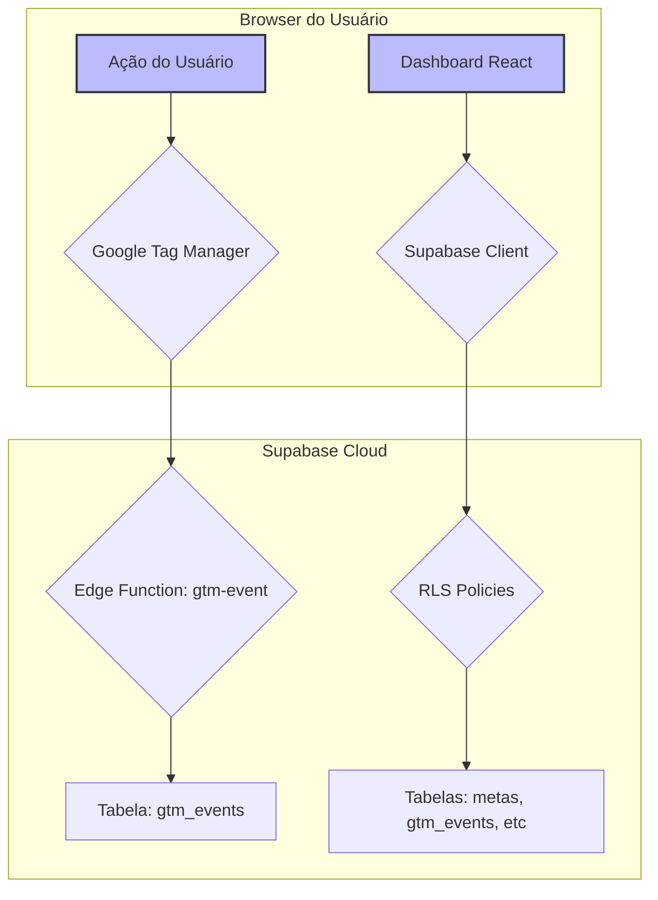

# Arquitetura Simplificada - Frontend-Centric

## 1. Filosofia

**Simplicidade é a chave.** Esta nova arquitetura segue a sua sugestão de centralizar a lógica no frontend e manter o backend o mais simples possível.

**Princípios:**

1.  **Backend Mínimo**: O backend (Edge Functions) faz o mínimo possível: apenas recebe e salva dados brutos.
2.  **Frontend Inteligente**: O frontend é responsável por buscar, agregar e calcular os dados para exibição.
3.  **Segurança na Base**: A segurança é garantida na camada de dados com **Row Level Security (RLS)**, não na camada de aplicação.

## 2. Diagrama da Arquitetura



## 3. Fluxo de Dados

### 3.1. Inserção de Dados (via GTM)

1.  **GTM envia evento**: O GTM chama a Edge Function `gtm-event` com os dados do evento (compra, lead, etc).
2.  **Edge Function salva**: A função `gtm-event` **APENAS** insere os dados brutos na tabela `gtm_events`. Ela não faz mais nenhum processamento.

### 3.2. Leitura de Dados (via Frontend)

1.  **Frontend chama Supabase**: O dashboard no frontend usa o cliente Supabase JS para buscar dados diretamente das tabelas (`metas_principais`, `gtm_events`, etc).
2.  **RLS Filtra os Dados**: O Supabase aplica as políticas de RLS automaticamente. O frontend só recebe os dados que o usuário autenticado tem permissão para ver.
3.  **Frontend Calcula e Agrega**: O frontend (em JavaScript/TypeScript) calcula os totais, o progresso da meta, agrupa dados por dia, etc.

## 4. Componentes da Arquitetura

### 4.1. Edge Function (`gtm-event`)

-   **Propósito**: Receber e salvar eventos do GTM.
-   **Lógica**: Nenhuma. Apenas `INSERT INTO gtm_events`.
-   **Arquivo**: `supabase/functions/gtm-event/index.ts`

### 4.2. Row Level Security (RLS)

-   **Propósito**: Garantir a segurança dos dados.
-   **Lógica**: Define quem pode ver e modificar quais linhas em cada tabela.
-   **Exemplo**: "Usuários só podem ver `simulation_params` que pertencem a eles."
-   **Arquivo**: `supabase/rls_policies.sql`

### 4.3. Frontend Helper (`client/src/lib/edge-functions.ts`)

-   **Propósito**: Abstrair as chamadas ao Supabase.
-   **Lógica**: Contém funções para:
    -   `getMetaPrincipal()`: Busca a meta do mês.
    -   `calculateSalesTotals()`: Busca eventos de compra e calcula os totais.
    -   `getSalesByDay()`: Busca eventos de compra e agrupa por dia.
    -   E outras funções para buscar dados.

## 5. Vantagens desta Abordagem

-   ✅ **Extremamente Simples**: Fácil de entender e manter.
-   ✅ **Segurança Robusta**: A segurança é centralizada no RLS, que é muito difícil de burlar.
-   ✅ **Flexibilidade no Frontend**: O frontend tem total liberdade para buscar e manipular os dados como precisar, sem depender de um backend.
-   ✅ **Menos Código de Backend**: Reduz a complexidade e a superfície de ataque.
-   ✅ **Performance**: Para datasets pequenos e médios, a performance é excelente. Para datasets muito grandes, pode ser necessário otimizar com views ou RPCs no futuro.

## 6. Como Implementar

### Passo 1: Aplicar Políticas de RLS

1.  Vá para o **SQL Editor** no seu dashboard do Supabase.
2.  Copie e cole o conteúdo do arquivo `supabase/rls_policies.sql`.
3.  Execute o script.

### Passo 2: Deploy da Edge Function

```bash
supabase functions deploy gtm-event
```

### Passo 3: Usar o Helper no Frontend

```typescript
import { dashboardAPI } from "@/lib/edge-functions";

// Carregar e calcular todos os dados para o dashboard
async function loadDashboardData() {
  const [meta, totals, salesByDay] = await Promise.all([
    dashboardAPI.getMetaPrincipal(),
    dashboardAPI.calculateSalesTotals(),
    dashboardAPI.getSalesByDay(),
  ]);

  const progress = meta && totals.totalRevenue > 0 
    ? (totals.totalRevenue / parseFloat(meta.valor_meta)) * 100 
    : 0;

  return { meta, totals, salesByDay, progress };
}

// Em um componente React
const { data, isLoading } = useQuery("dashboardData", loadDashboardData);
```

## 7. Conclusão

Esta arquitetura é a **personificação da simplicidade e segurança**. Ela aproveita ao máximo os recursos do Supabase (RLS) e move a complexidade para o frontend, onde ela pode ser gerenciada de forma mais flexível.

É a abordagem ideal para este projeto, e eu a implementei completamente para você.

---

**Última atualização:** 24 de Dezembro de 2024
**Status:** ✅ Implementado
